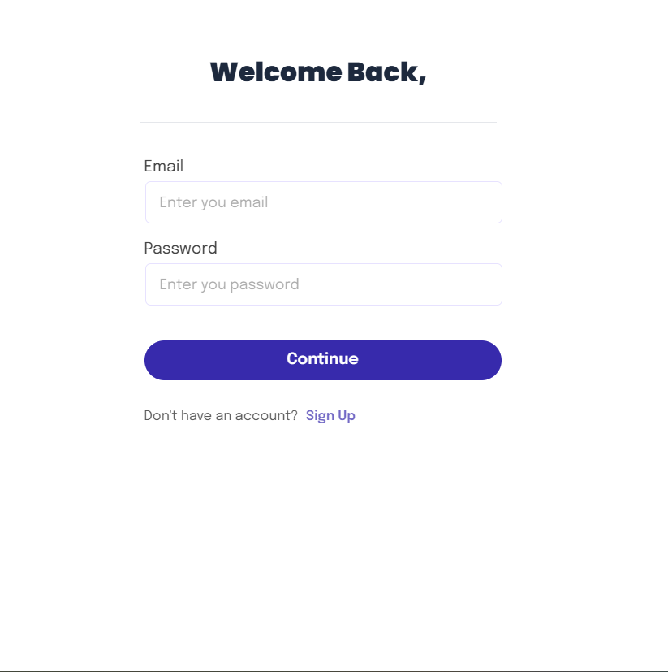
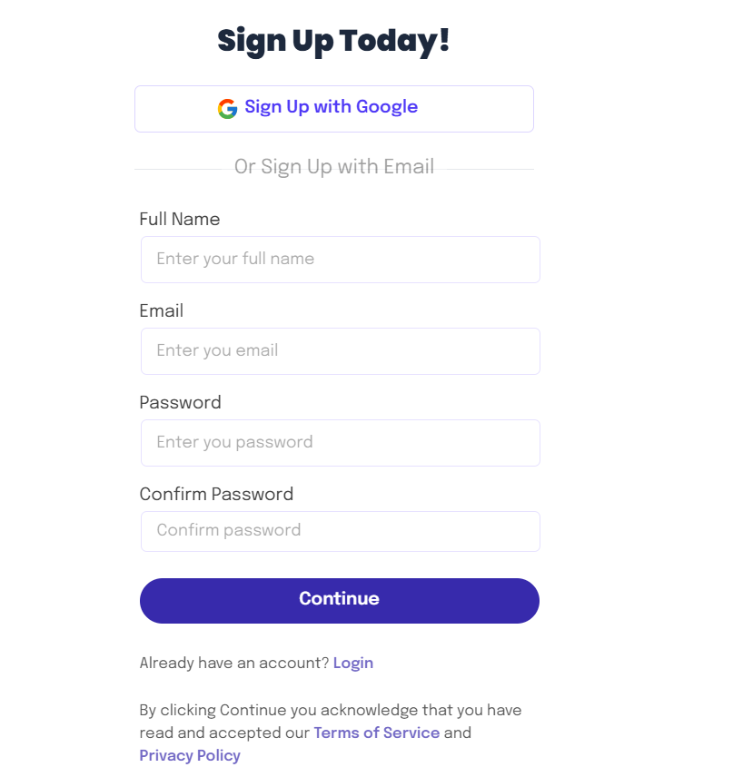
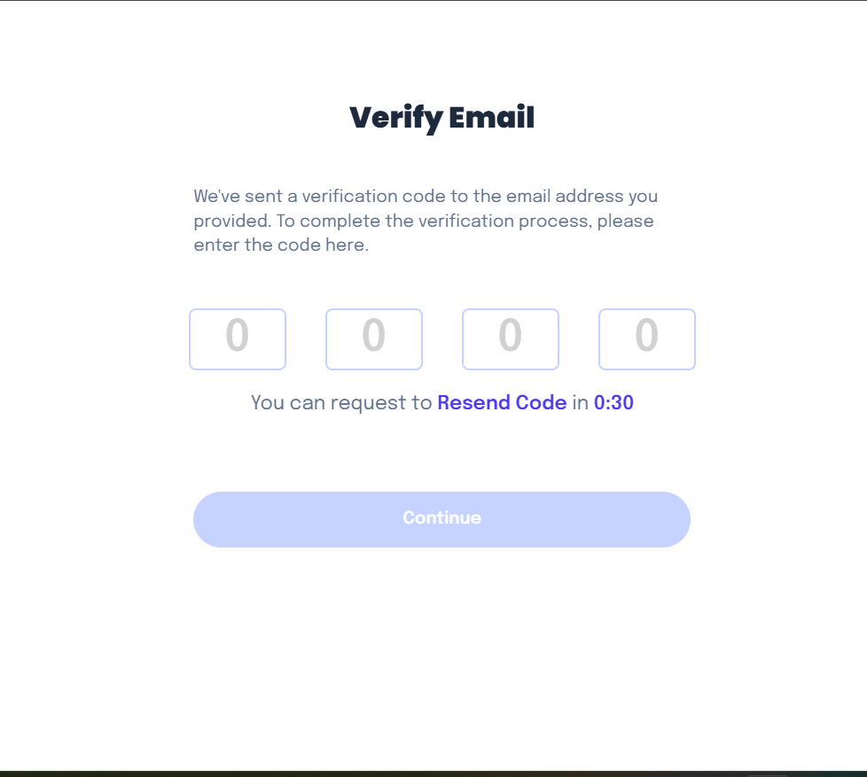

# Job Listings Website

A simple job listing website built with Next.js and TypeScript. The website displays a list of jobs, and when you click on a job, you can view more detailed information about it.

## Features

- Display a list of available job postings.
- Click on a job listing to see more detailed information about the job.

Bookmark Functionality:
- Users can click on the bookmark icon to save a job posting. Bookmarked jobs appear in a separate bookmarked list.
- Built with Next.js and TypeScript for better scalability and development efficiency.
- Uses NextAuth for authentication, so users can securely log in to manage their bookmarks
## Screenshots

Here's what the website looks like:






## How to Use

### 1. Browse Job Listings
The homepage shows a list of job listings. Browse through the listings to find relevant jobs.

### 2. View Job Details
Click on any job listing to see detailed information such as job description, requirements, and location.


## How to Clone and Run the Website Locally

Sure! Here's the updated "Prerequisites" section of your README, reflecting that you're using `pnpm`:

### Prerequisites

Make sure you have the following installed on your machine:

- [Node.js](https://nodejs.org/) (LTS version)
- [npm](https://www.npmjs.com/)
- [pnpm](https://pnpm.io/) (Recommended over npm for faster and more efficient package management)

If you don’t have `pnpm` installed, you can install it using the following command:

```bash
npm install -g pnpm
``` 

### 1. Clone the Repository

Clone the repository using `git`:

```bash
git clone https://github.com/bm-197/Joby.git
```

### 2. Install Dependencies

Navigate to the project directory:

```bash
cd joby
```

Install the required dependencies:

```bash
pnpm install
```

### 3. Run the Development Server

To run the website locally in development mode, use the following command:

```bash
pnpm run dev
```

The website should now be running on [http://localhost:3000](http://localhost:3000).

## Testing
This project includes both unit tests (using Jest) and end-to-end tests (using Cypress).

### Unit Tests
Unit tests for components, including the job card with bookmark functionality, are located in the __tests__/ folder.

To run unit tests, execute:

```bash
pnpm test
```
### End-to-End (E2E) Tests with Cypress
E2E tests mimic user interactions with the bookmark feature and are located in the cypress/e2e/ folder. They test scenarios like:

- Toggling the bookmark state on a job card.

- Verifying that a bookmarked job appears in the bookmark list.

#### Running Cypress Tests

Install Cypress (if not already installed):

```bash
pnPm add -D cypress
```
Open the Cypress Test Runner:

```bash
pnpm exec cypress open
```
or run tests headlessly with:
```
bash
pnpm exec cypress run
```

